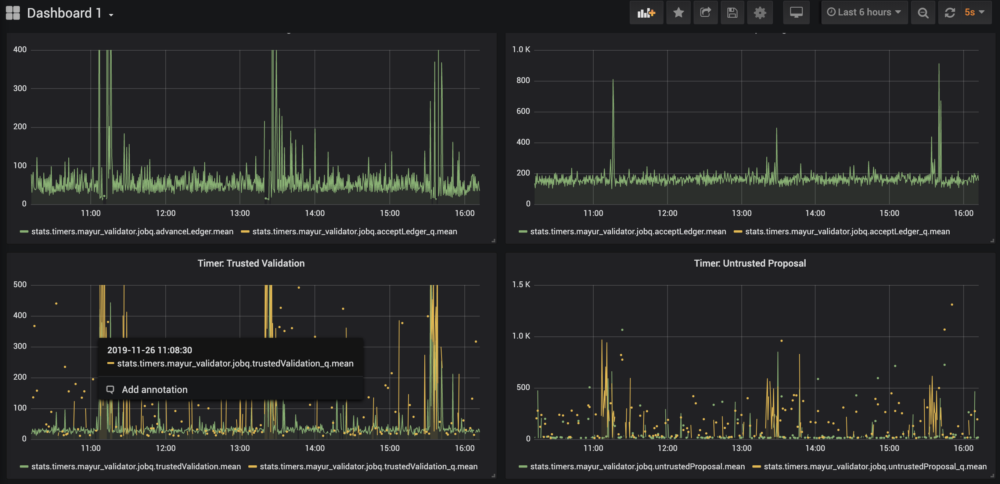
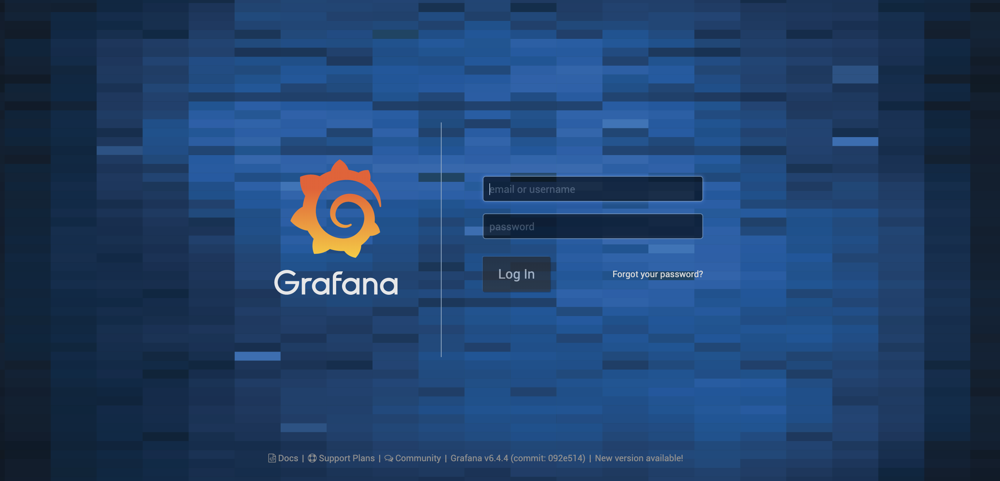
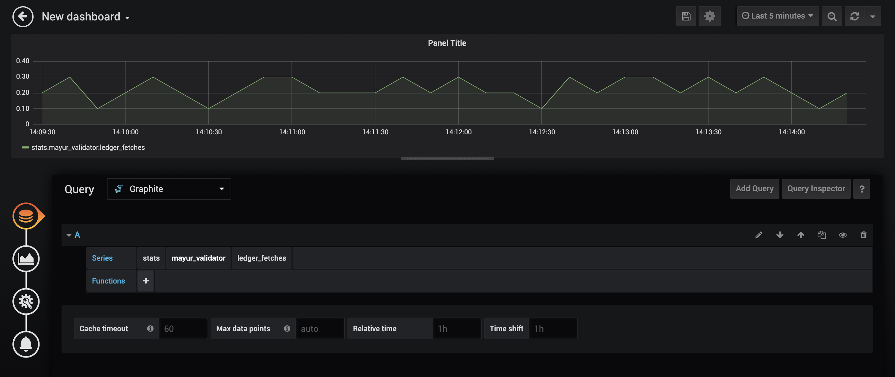

# rippledmon
Keep an eye on your rippled server with this drop-in monitoring solution.


# Background
[rippled](https://github.com/ripple/rippled) is equipped to export metrics via statsd when "insights" are enabled. This monitoring tool consumes and presents those metrics via statsd-graphite and Grafana docker containers. New versions of rippled will export more metrics and new dashboards will be added to this repository. 




# Prerequisites 
Docker and docker-compose must be installed on your system. For more details on this see [here](https://docs.docker.com/install/) for docker and [here](https://docs.docker.com/compose/install/) for docker-compose.


# Installation

1. Clone this repo and start the docker containers with docker-compose

```
$ git clone https://github.com/ripple/rippledmon.git
$ cd rippledmon
$ docker-compose up
```
Note: you can use the -d flag in the docker-compose command to run it in the background.

2. Add the [insight] stanza to your rippled.cfg file, and restart your rippled server.

```
[insight]
server=statsd
address=127.0.0.1:8125
prefix=my_rippled
```

This will enable insights on your rippled server and send metrics via UDP to a statsd server listening on port 8125 of your localhost. The metrics will be prefixed with 'my_rippled'. **NOTE: If you are using this tool to monitor a production grade validator, you should run it on a separate machine and change the address above** 

3. Login to Grafana and view dashboards

```
In your browser go to http://localhost:3000 
```


The default username and password are 'admin'. Dashboard 1 is an example displaying a few of the metrics exported from rippled. It can take a few minutes for these metrics to populate so be patient. 

4. Make new dashboards

You can make new dashboards with the specific metrics that you want by selecting the plus icon and choosing "Add Query" in the New Panel. 


Choose the appropriate tags to query the metric you want and adjust the graphing parameters.



For more information on how to use Grafana see [here](https://grafana.com/docs/grafana/latest/guides/getting_started/).

# Metrics

Metrics will be added to rippled over time and new dashboards will be added to this repo. These are the metrics that are currently visible: 

| Timer Metric Tags |
|----------|
| jobq.untrustedProposal | 
| jobq.trustedProposal |
| jobq.untrustedValidation |
| jobq.trustedValidation |
| jobq.heartbeat | 
| jobq.ledgerRequest |  
| jobq.acceptLedger |
| jobq.advanceLedger |
| jobq.clientCommand |
| jobq.ledgerData |
| jobq.transaction | 
| jobq.fetchTxnData | 
| jobq.ledgerData |
| jobq.writeObjects |
| jobq.batch |
| jobq.sweep |
| jobq.clientCommand |
| jobq.clusterReport |

Timers with the jobq tag report the amount of time it took to execute the job in ms. You will also see the metrics above with an "_q" suffix. The corresponding "_q" metrics report the amount of time it took to dequeue the job. 

| Counter Metric Tags |Description|
|---------------------|:---------|
| ledger_fetches | Number of ledger fetches in the last collection interval|
| jobq.job_count | Number of jobs in the job queue |
| full_below.size | Size of the [FullBelowCache](https://github.com/ripple/rippled/blob/develop/src/ripple/shamap/FullBelowCache.h)
| full_below.hit_rate | Hit Rate of the [FullBelowCache](https://github.com/ripple/rippled/blob/develop/src/ripple/shamap/FullBelowCache.h)|\

**Age Gauges**
| Age Gauge Metric Tags | Description |
|---------------------|:---------|
| LedgerMaster.Validated_Ledger_Age| The age of the last validated ledger in seconds|
| LedgerMaster.Published_Ledger_Age| The age of the last published ledger in seconds|

**State Accounting Gauges**
| State Accounting Gauge Metric Tags | Description |
|---------------------|:---------|
| State_Accounting.Disconnected_duration| The total amount of time spent in the 'Disconnected' state as displayed by server_info in microseconds|
| State_Accounting.Connected_duration| The total amount of time spent in the 'Connected' state as displayed by server_info in microseconds|
| State_Accounting.Syncing_duration| The total amount of time spent in the 'Syncing' state as displayed by server_info in microseconds|
| State_Accounting.Tracking_duration| The total amount of time spent in the 'Tracking' state as displayed by server_info in microseconds|
| State_Accounting.Full_duration| The total amount of time spent in the 'Full' state as output by server_info in microseconds|
| State_Accounting.Disconnected_transitions| The number of transitions into the 'Disconnected' state as displayed by server_info|
| State_Accounting.Connected_transitions| The number of transitions into the 'Connected' state as displayed by server_info|
| State_Accounting.Syncing_transitions| The number of transitions into the 'Syncing' state as displayed by server_info|
| State_Accounting.Tracking_transitions| The number of transitions into the 'Tracking' state as displayed by server_info|
| State_Accounting.Full_transitions| The number of transitions into the 'Full' state as displayed by server_info|

**Peer Metric Gauges**
| Gauge Metric Tags | Description |
|---------------------|:---------|
| Peer_Finder.Active_Inbound_Peers| The number of active inbound peer connections|
| Peer_Finder.Active_Outbound_Peers| The number of active outbound peer connections|
| Overlay.Peer_Disconnects| The total number of peer disconnects |


**Traffic Counts Gauges**
Traffic count metrics are exported for each of the traffic categories below. There are 4 different metrics tracked for each category: BytesIn, BytesOut, MessagesIn, and MessagesOut.

| Traffic Count Gauge Metric Tags | Description |
|---------------------|:---------|
| *category*.BytesIn | Total number of bytes received from traffic of this category|
|*category*.BytesOut| Total number of bytes transmitted from traffic of this category
|*category*.MessagesIn| Total number of messages recieved from traffic of this category|
|*category*.MessageOut| Total number of messages transmitted from traffic of this category|


|Traffic Categories|
|----------|
|overhead|                                     
|overhead_cluster|                               
|overhead_overlay|                               
|overhead_manifest|                              
|transactions|                                
|proposals|                                   
|validations|                                  
|shards|                                       
|set_get|                                        
|set_share|                                       
|ledger_data_Transaction_Set_candidate_get|       
|ledger_data_Transaction_Set_candidate_share|     
|ledger_data_Transaction_Node_get|                
|ledger_data_Transaction_Node_share|             
|ledger_data_Account_State_Node_get|              
|ledger_data_Account_State_Node_share|            
|ledger_data_get|                                
|ledger_data_share|                              
|ledger_Transaction_Set_candidate_share|          
|ledger_Transaction_Set_candidate_get|          
|ledger_Transaction_node_share|                
|ledger_Transaction_node_get|                   
|ledger_Account_State_node_share|                 
|ledger_Account_State_node_get|                 
|ledger_share|                        
|ledger_get|                                
|getobject_Ledger_share|                         
|getobject_Ledger_get|                          
|getobject_Transaction_share|                    
|getobject_Transaction_get|                       
|getobject_Transaction_node_share|                
|getobject_Transaction_node_get|                 
|getobject_Account_State_node_share|              
|getobject_Account_State_node_get|               
|getobject_CAS_share|                    
|getobject_CAS_get|                       
|getobject_Fetch_Pack_share|                     
|getobject_Fetch Pack_get|                      
|getobject_share|                          
|getobject_get|                          
|unknown|                        

Please note that all gauge type metrics are only sent when their value changes in rippled at least once. If you do not see any particular metric it means that it has not changed since startup. 

## Acknowledgements:
Inspired by [lndmon](https://github.com/lightninglabs/lndmon)  
Uses [graphite-project](https://github.com/graphite-project/docker-graphite-statsd) and [Grafana](https://github.com/grafana/grafana)


    


